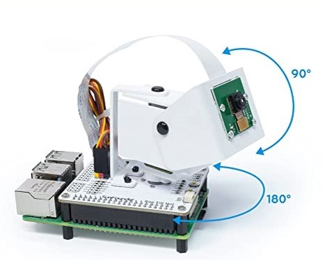
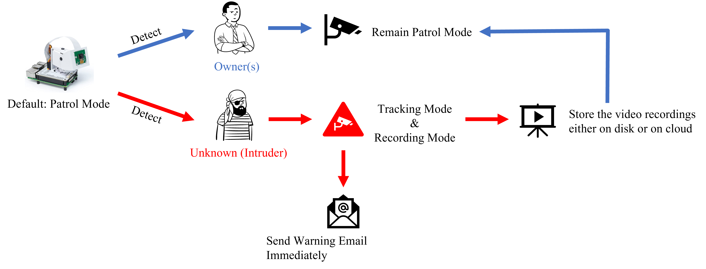
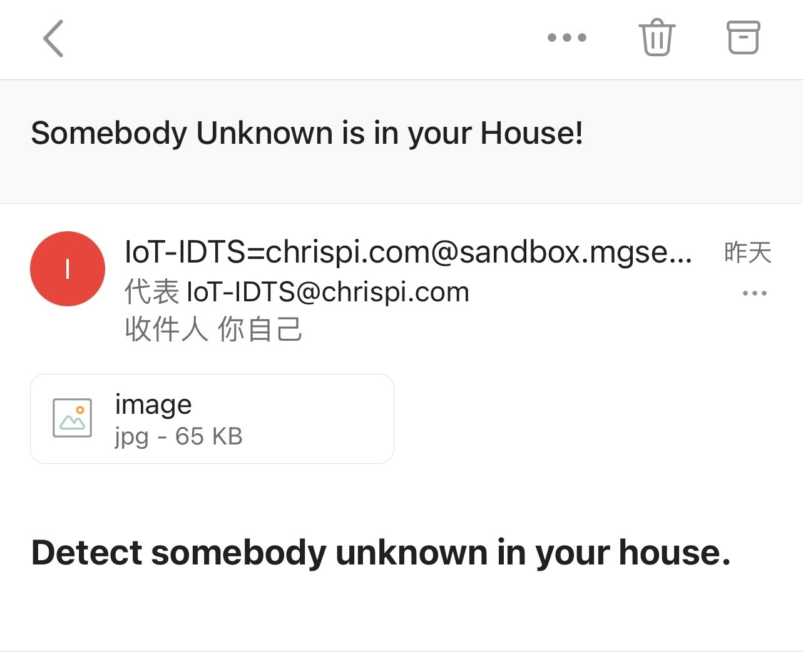
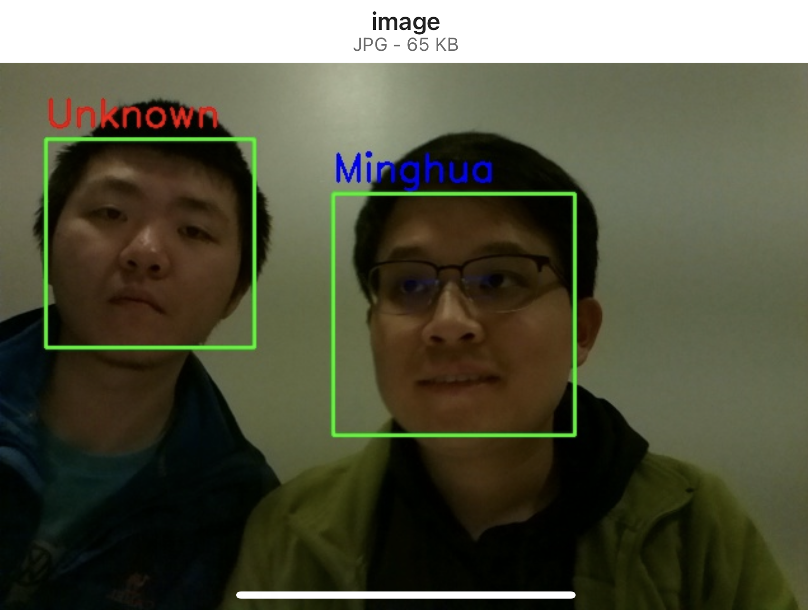

# IoT System - Intruder Detection and Tracking System (IDTS)

## Motivations
- Traditional cameras are typically fixed in position, making it difficult to prevent incidents such as burglary or intrusions in real-time.
- However, with IDTS, cameras can be customized with an updatable database, allowing for early warning and potential prevention of further losses.

## Architecture
IDTS consists of a Raspberry Pi, a Pan-Tilt HAT built on the pi, and a Pi Camera installed on the Pan-Tilt HAT, which can move horizontally and vertically.

<!--  -->

    

## Design Logic
In default, IDTS is in Patrol Mode (the Camera is scanning back and forth in order to find someone suspicious). When the system detects somebody that belongs to the "Owners" (someone is in the database), it will remain Patrol Mode. However, when IDTS detects someone that is not in the database likes an intruder, it will mark this person as "Unknown" and then start Tracking Mode and Recording Mode, and also send a warning email to the owners immediately. After the intruder leaves the screen or we end the process, IDTS will store the video recordings either on disk or on cloud, and then return to Patrol Mode.

<!--  -->

    

## Demo ([link](https://drive.google.com/file/d/1COsq03mhZJ-JerE1zMJvKKvc3m-Ofq7w/view?usp=sharing))
In this demo, the IDTS first recognized me (Minghua) as the owner, so it kept scanning. Then, it detected someone "Unknown", so it started the Tracking Mode and Recording Mode. Either this unknown person moved left or right, up or down, IDTS can always follow him and put this unknown face in the center of the screen.

And I (owner) also received a warning email saying that "Detect somebody unknown in your house" and an attached image of the screenshot of the unknown intruder. Besides, IDTS will only record those frames with detected unknown faces into a mp4 file stored either on disk or on cloud.

<!--   -->

    

    

#### [--- See whole Introduction about IDTS ---](https://drive.google.com/file/d/19uvKNWkTrf-okg6nVpgeNVvF1yxlIIuz/view?usp=drive_link)

## Quick Start
- Create a `dataset` folder and a `warnings` folder. Run `python capture_headshot.py yourname` to take some headshots, these training images will be stored in folder "dataset".
- Run `python pretrain.py` to train the model with the images in dataset. A `pre-trained.yml` will be generated when it's finished.
- Run `python face_recog.py` to start IDTS, all warning images/videos will be stored in folder "warnings". 
- (Optional) Modify `send_email.py` to enable the functionality of sending warning emails. Modify `servo.py` to adjust the movement speed of the Pan-Tilt HAT.
